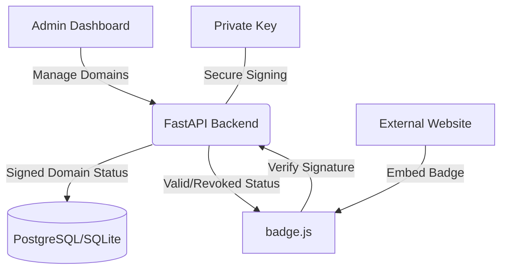
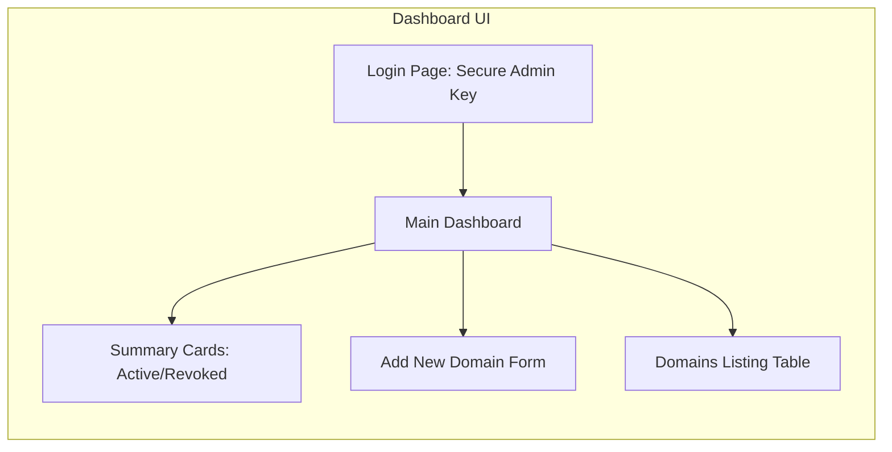

# 🟢 Compliance Verification System — Client Guide
# 🟢 نظام التحقق من الامتثال — دليل العميل

This guide provides an overview of the "Compliance Status Publishing & Verification" system, its usage, and technical validation.
يوفر هذا الدليل نظرة عامة على نظام "نشر والتحقق من حالة الامتثال"، وطريقة استخدامه، والتحقق الفني منه.

---

## 1. System Architecture / هندسة النظام

The system is built as a lightweight monolith using **FastAPI** (Backend) and **React** (Admin Dashboard). It uses **Ed25519** high-speed cryptography for digital signatures.
تم بناء النظام كهيكل موحد وخفيف الوزن باستخدام **FastAPI** (الخلفية) و **React** (لوحة تحكم المسؤول). يستخدم تشفير **Ed25519** عالي السرعة للتوقيعات الرقمية.



---

## 2. Admin Dashboard / لوحة تحكم المسؤول

The Dashboard allows you to manage compliance records for your domains.
تسمح لك لوحة التحكم بإدارة سجلات الامتثال لنطاقاتك.

**Layout Overview / نظرة عامة على التصميم:**



### Key Features / المميزات الرئيسية:
- **English:** Secure login via API Key, domain creation with compliance levels, instant cryptographic signing, status revocation, and one-click JSON export.
- **عربي:** تسجيل دخول آمن عبر مفتاح واجهة برمجة التطبيقات (API Key)، إنشاء النطاقات مع مستويات الامتثال، توقيع رقمي فوري، إلغاء الحالة، وتصدير البيانات بتنسيق JSON بنقرة واحدة.

---

## 3. Compliance Badge / شارة الامتثال

The badge is a single JavaScript file that can be embedded on any website.
الشارة عبارة عن ملف JavaScript واحد يمكن دمجه في أي موقع إلكتروني.

### Implementation / التنفيذ:
```html
<!-- Paste this where you want the badge to appear -->
<script 
  src="http://YOUR_API_URL/badge/badge.js" 
  data-domain="your-site.com" 
  data-api="http://YOUR_API_URL">
</script>
```

**Visual States / الحالات المرئية:**
- **Active (Green):** Indicates the domain is compliant and the digital signature is valid.
- **نشط (أخضر):** يشير إلى أن النطاق ممتثل وأن التوقيع الرقمي صالح.
- **Revoked (Red):** Indicates the compliance has been withdrawn.
- **ملغى (أحمر):** يشير إلى أنه تم سحب الامتثال.

---

## 4. Technical Validation / التحقق الفني

We have verified the system with **15 automated tests** covering all security and logic aspects.
لقد تحققنا من النظام من خلال **15 اختباراً آلياً** تغطي جميع جوانب الأمان والمنطق.

### Verification Results / نتائج التحقق:
- **Ed25519 Integrity:** Signatures are unique and tamper-proof. (Verified)
- **API Security:** Admin routes are protected by secret keys. (Verified)
- **Real-time Verification:** The public endpoint validates signatures before responding. (Verified)

**Live Test Sample / عينة من اختبار حي (JSON):**
```json
{
  "domain_name": "example.com",
  "status": "active",
  "signature_valid": true,
  "compliance_level": "advanced",
  "issued_at": "2026-02-24T15:15:20Z"
}
```

---

## 5. Security Note / ملاحظة أمنية
The **Private Key** used for signing is never exposed via the API and resides safely on the server backend. This ensures the integrity of your compliance certificates.
مفتاح التوقيع **الخاص** (Private Key) المستخدم للتوقيع لا يتم كشفه أبداً عبر واجهة برمجة التطبيقات ويظل آمناً في خلفية الخادم. هذا يضمن سلامة شهادات الامتثال الخاصة بك.
